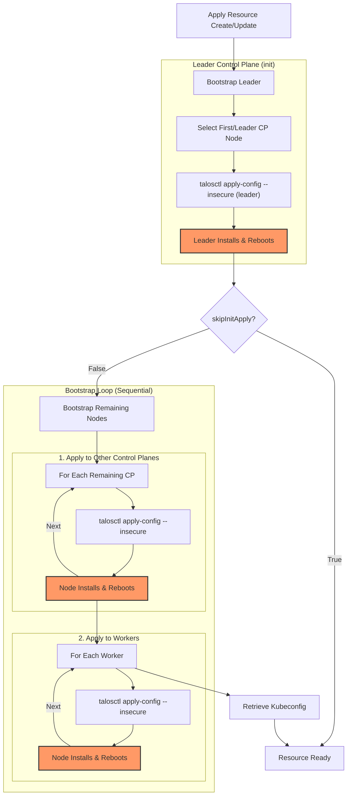

# Repository Guidelines

## Project Structure & Modules
- `provider/`: Pulumi component source and CLI binaries (`pulumi-resource-talos-cluster`, codegen under `cmd/`, shared packages in `pkg/`).
- `sdk/`: Generated language SDKs (`go`, `dotnet`, `nodejs`, `python`); rebuilt via Make targets.
- `integration-tests/`: End-to-end and fixture programs; `testdata/programs` holds example Pulumi apps for clouds (e.g., `hcloud-go`, `hcloud-ha-go`).
- `deploy/`: Environment presets and helper assets; `bin/` holds built binaries.

## Build, Test, and Development Commands
- `make build && make install_provider`: Generate schema, build provider, and install it into `GOPATH/bin`.
- `make generate`: Regenerate all SDKs from the current schema.
- `make lint`: Run `golangci-lint` across provider and integration helpers.
- `make unit_tests`: Run Go unit tests (excludes generated/CRD packages).
- `make integration_tests`: Build provider and SDKs, then run long E2E suites (set `TEST=<regex>` to scope, e.g., `TEST=TestHcloud make integration_tests_go`).
- Node SDK iteration: `make build_nodejs_sdk` then `yarn link --cwd sdk/nodejs/bin` for local use.

## Coding Style & Naming Conventions
- Go code must be `gofmt`-clean and pass `golangci-lint`; prefer idiomatic interfaces and explicit error wrapping (`github.com/pkg/errors`).
- Keep package names lower_snake for generated SDKs and lowerCamel for Go vars/functions unless exported.
- Use concise, imperative names for Make targets and tests (e.g., `TestApplyClusterSpec`).
- Avoid editing generated SDK output directly; regenerate via Make if schema changes.
- TypeScript: prefer `type` aliases over `interface` unless interface merging is required.
- Schema validation: when a JSON Schema validates inputs, avoid repeating the same checks in code unless absolutely necessary; rely on the validated shape for type assertions.
- Avoid generic coercion helpers (e.g., `toString(any) string`); prefer explicit typed access after validation or straightforward type assertions.
- Pulumi SDK/binaries upgrade procedure (keep versions in sync):
  1) Update Go modules: `go get github.com/pulumi/pulumi/sdk/v3@<version>` in `provider/`, `integration-tests/`, `sdk/`, and Go test programs (e.g., `integration-tests/testdata/programs/hcloud-go`, `hcloud-ha-go`), then `go mod tidy` in each.
     Also bump `github.com/pulumi/pulumi/pkg/v3@<version>` in those same modules to avoid mismatch errors.
     For Talos dependencies, align `github.com/siderolabs/talos/pkg/machinery` to the desired Talos release (e.g., `v1.11.5`) in `provider/` and tidy.
  2) Update Node dependencies: bump `@pulumi/pulumi` in `integration-tests/package.json` and JS test programs (e.g., `integration-tests/testdata/programs/hcloud-js/package.json`), then run `yarn install` to refresh locks.
     Align `@pulumiverse/talos` to the Talos version in the schema generator and generated `schema.json` (e.g., `v0.6.1` for Talos 1.11.5).
  3) Update Python requirements: set `pulumi==<version>` in `integration-tests/requirements.txt` and Python test programs (e.g., `integration-tests/testdata/programs/hcloud-ha-py/requirements.txt`).
  4) Update `.pulumi.version` to the same version you just bumped.
  5) Regenerate provider/SDK artifacts if schema changes accompany the upgrade.
  6) After version bumps, regenerate SDKs with `make generate_schema && make generate && make build` (requires `pulumictl` and `pulumi` on PATH). If missing locally, ensure these binaries are installed before running.
  7) Tidy modules/checksums after bumps: `go mod tidy` in `provider/` and `integration-tests/`, then `go work sync` at repo root to refresh `go.sum`/`go.work.sum`.
  8) If stale Pulumi versions linger in `go.work.sum`, delete the file and run `go list -m all` (then `go work sync`) to regenerate it.
  9) Packer images: when upgrading Talos/Pulumi, bump versions in `integration-tests/packer/hcloud-talos.pkr.hcl` and rebuild the test image (see `integration-tests/packer/README.md`).

## Testing Guidelines
- **Framework**: The testing framework uses Go's standard `testing` package with `stretchr/testify` helpers. The integration tests, located in `integration-tests/`, are written in Go and orchestrate deployments of Pulumi programs written in various languages (Go, Python, Node.js).
- **Unit Tests**:
  - Run with: `make unit_tests`
  - These are standard Go tests located in the `provider/` directory. They focus on testing individual components of the provider and exclude generated code.
- **Integration Tests**:
  - Run all: `make integration_tests`
  - These are end-to-end tests that deploy real infrastructure. They can be time-consuming (default timeout is 25m).
  - You can run tests for a specific language SDK, for example: `make integration_tests_go` or `make integration_tests_nodejs`.
  - To run a specific test case, use the `TEST` variable: `TEST=TestHcloud make integration_tests_go`.
  - Test programs (the Pulumi apps being deployed) are located in `integration-tests/testdata/programs/`.
  - Shared test helper code is in `integration-tests/pkg/`.
- **Prerequisites**: Integration tests require credentials for the target cloud provider and a working `talosctl` configuration.
- **Layout**: The test helpers contain spec files for different languages (`spec.go`, `spec.py`, `spec.ts`). These implementations share a common `schema.json` source of truth to ensure consistent validation logic across all supported languages.
- **Architecture**:
  - The `cluster` package serves as the main entrypoint for tests. It orchestrates calls to the `cloud` and `talos` packages.
  - The `cluster` validation logic only covers the basic and common cluster specification.
  - Default values and specific validation for `talos` and `cloud` configurations are handled within their respective packages.

#### Configuration File Validation (`cluster.yaml`)

When loading and validating configuration files like the cluster specification YAML, a consistent, multi-language pattern is enforced to ensure robustness and maintainability. This pattern is implemented for TypeScript, Go, and Python in `integration-tests/pkg/cluster/`.

**Key Principles:**

*   **Single Source of Truth**: A canonical `schema.json` file, located in the `integration-tests/pkg/cluster/` directory, serves as the single source of truth for the configuration's structure, types, and constraints.
*   **Strict Schema**: The schema should be "strict." This means `additionalProperties` should be set to `false` to prevent unknown fields, and all properties should be explicitly listed as `required` where appropriate.
*   **Two-Phase Validation**: A two-phase validation approach is used:
    1.  **Schema Validation**: Raw data parsed from YAML is first validated against the `schema.json` using a language-specific JSON Schema validator (`ajv` for TS, `jsonschema` for Python). This catches all structural, type, and enum violations.
    2.  **Custom Logic Validation**: After schema validation passes, programmatic checks are run to enforce complex rules that cannot be expressed in JSON Schema (e.g., validating that a machine's IP address falls within a given network CIDR).
*   **Implementation**:
    *   Validation logic is isolated in a dedicated module (e.g., `validation.ts`).
    *   Validation functions should throw an exception (or return an error in Go) on failure and return nothing on success.
    *   The loader/spec file (e.g., `spec.ts`) orchestrates the process:
        1. Parse the YAML file into a generic object (e.g., `Record<string, unknown>` or `dict`).
        2. Call the validation function with the generic object.
        3. If validation succeeds, normalize the validated object into strongly-typed language-specific structs or classes.

This pattern ensures that any data used in the integration tests is guaranteed to be structurally and logically correct.

## Commit & Pull Request Guidelines
- Commit messages follow short, imperative style with optional scope (`chore: gofmt integration test helpers`, `refactor hcloud spec`); do not use emoji. The emoji is used by developers only.
- PRs should explain intent, link issues, and note any infra prerequisites. Include run results for `make lint`, `make unit_tests`, and any scoped integration tests.
- For schema or SDK changes, mention regenerated artifacts and the `VERSION` used; prefer separate commits for regeneration vs. release steps.

## Security & Configuration Tips
- Development assumes Linux with `bash`, `printf`, `talosctl`, Go toolchain, Pulumi CLI, and `pulumictl`.
- Avoid committing cloud credentials; rely on environment variables or profiles consumed by integration tests.
- When debugging provider binaries, `make start_delve` launches `dlv` headless on port 2345 for remote attach. You can also connect directly with `PAGER=cat dlv connect pulumi-workbench-delve:2345`; prepare a dlv init script to automate any interactive commands.
- Do not add `pulumi-talos-cluster-integration-tests-infra` to `package.json`; Pulumi installs projects in a temp directory with relative paths and the dependency fails to resolve there.

## Provider Bootstrap Process
The following diagram illustrates the sequential bootstrap process for the `Apply` resource when `skipInitApply` is false.



## Talos Workdir Layout (talosctl)
Talos client state is scoped per stack under the OS temp dir:
```
<tmp>/talos-home-for-<stack>/
  <step>-<machine-id>/   # e.g., cli-apply-controlplane-1, cli-upgrade-worker-1
    talosctl.yaml
    ...other artifacts...
```
Each Apply/step gets its own nested folder to avoid state clashes across machines/operations.
